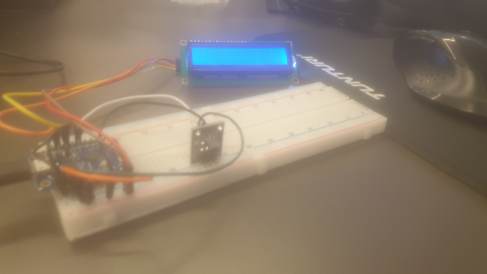
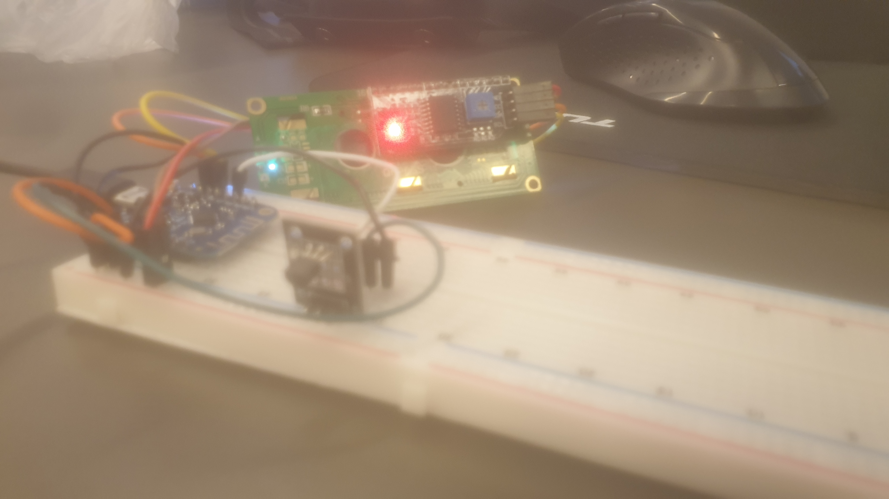
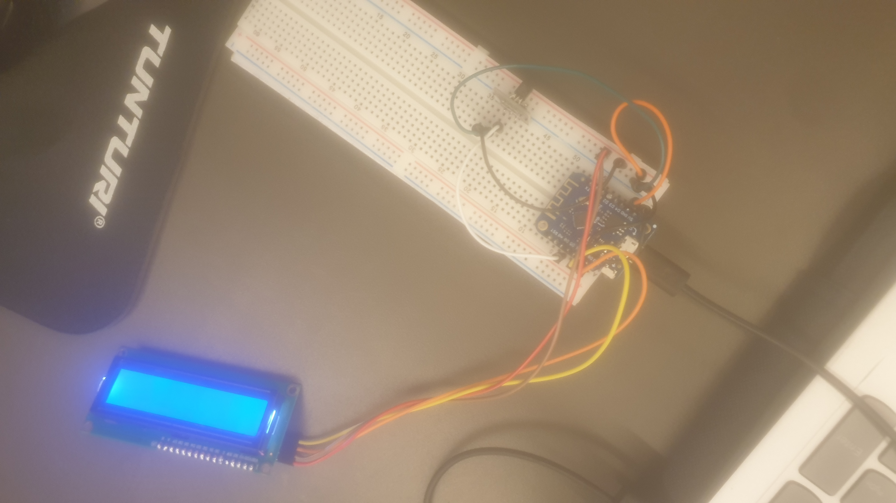
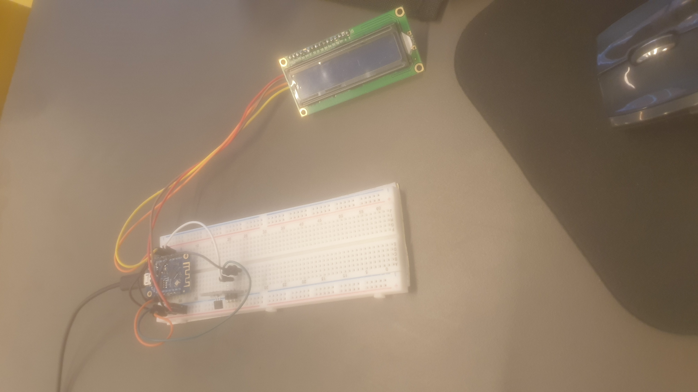

# Physical design
   
## Concept

De blueprint wheaterstation is bedoeld voor voor gebruikers tussen de 18 en 40 jaar die veel buiten sprten en dit station gaan gebruiken voor de realtime tempratuur buiten. Ook is het de bedoelling dat deze gebruikers naar de vochtigheidsgraad kunnen kijken om zo te bepalen welke kleding ze gaan dragen voor het sporten buiten.

## Digital manufacturing materials and methods

## Design

Het design moet simpel zijn en vooral praktisch zijn voor outdoor use. het enige wat de gebruiker zou moeten zien is het scherm. De behuizing moet ervoor zorgen dat het product makkelijk te verplaatsen wordt en om de hardware te verbergen/beschermen.
## Prototype

Het prototype is goed op weg naar het gewenste resultaat, maar nog lang niet af, er zit een inputsensor (tempratuur) In en er zit output (Beeldscherm) aan gekoppeld. Ik heb zeker nog hulp nodig voor het eindproduct. Ik ben er nog niet helemaal uit wat de tweede outputsensor wordt en hoe ik dat gaat koppelen. Het einddoel is dat het product mobiel wordt en over in en om het huis te gebruiken is voor de gewenste output van de user.

## Create

## Conclusion

## Failures

!!! Failure
    Het beeldscherm is alleen blauw en laat geen tempratuur zien nog. Ik mis nog de juiste code voor de meting van de tempratuur zodat ik de tempratuur op het scherm kan afbeelden. 

!!! Failure
    Failure 2

!!! Failure
    Failure 3

!!! Failure
    Failure 4
